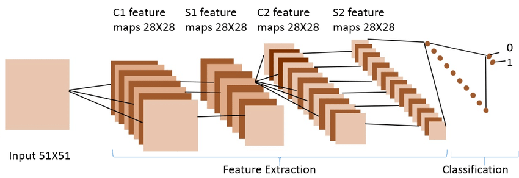
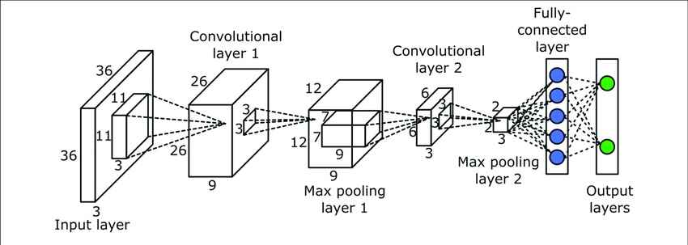
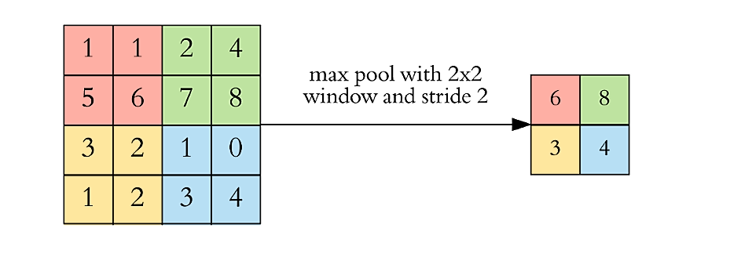
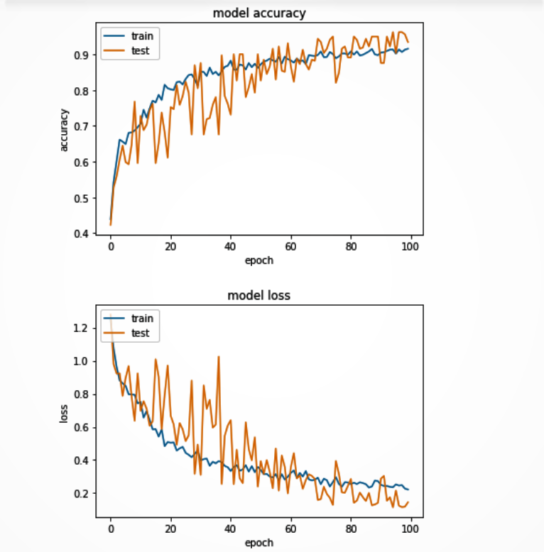

# Cotton Plant Disease Detection and Get Cure AI APP 

APP Link : https://cottonplantcurepy.herokuapp.com/

The major problem that the farmers around the world face is losses, because of pests, disease or a nutrient deficiency. They depend upon the information that they get from the agricultural departments for the diagnosis of plant leaf disease. This process is lengthy and complicated. Here comes a system to help farmers everywhere in the world by automatically detecting cotton leaf diseases accurately and within no time. In this paper, the proposed system uses a type of CNN for classification of leaf disease. Several experiments are performed on the dataset to get the accurate output. The proposed system can effectively identified different types of diseases with the ability to deal with complex scenarios from a plant’s area.

<ul>

In this we are focused on detecting cotton leaf diseases at an early stage, thereby decreasing the chances of the destruction of the whole plant. Traditional methods of detecting a disease include manual examining of a leaf and predicting the disease. But a farmer cannot determine the exact disease by this technique. Therefore, knowing the accurate disease image processing techniques can be utilized to recognize the disease of the plant leaf. These are modern techniques that make use of new technologies that give accurate results. 

## Data Pre-Processing
It Contains several steps like :

<li>Data Collection
<li>Data Import
<li>Data Inspection
<li>Data Splitting
<li>Resizing image data
  
## Feature Extraction
In Traditional Machine Learning,

Input Image >> Feature Selections >> Classifier >> Result

In Deep Learning,

Input Image >> Neural Network >> Result

For Convolutional Neural Network (CNN),

Input Layer >> Hidden Layers >> Output

Here, input layer takes the input and output gives the desired output. That means hidden layer is doing some feature extractions. And if we extract the outputs of the hidden layers, then we will get different features.

So basically, In ML we have to create our own feature vector, while for DL algorithms they extract features automatically in convolution layers

## Convolutional Neural Network

A CNN is composed of two basic parts of feature extraction and classification.
<li>Feature extraction includes several convolution layers followed by max-pooling and an activation function.
<li>The classifier usually consists of fully connected layers.
<li>CNN automatically detects the important features without any human supervision
<li>And it makes efficient model which performs automatic feature extraction to achieve superhuman accuracy
  
  

#### CNN Model Building Details :
<li>The main building block of CNN is the convolutional layer.
<li>Convolution is a mathematical operation to merge two sets of information.
<li>In our case the convolution is applied on the input data using a convolution filter to produce a feature map.
<li>After a convolution operation we usually perform pooling to reduce the dimensionality. This enables us to reduce the number of parameters, which both shortens the training time and combats overfitting.
<li>Pooling layers downsample each feature map independently, reducing the height and width.
<li>The output of both convolution and pooling layers are 3D volumes, but a fully connected layer expects a 1D vector of numbers.
<li>So we flatten the output of the final pooling layer to a vector and that becomes the input to the fully connected layer.
<li>Flattening is simply arranging the 3D volume of numbers into a 1D vector.
  

## Results: 

Date : March 31, 2021

----At epoch 82----

Training accuracy : 90.11 %

Validation accuracy : 94.69 % (highest)

Training loss : 0.279

Validation loss : 0.286

